# Aeon-Railguard

<div align="center">


# 🚆 Aeon RailGuard: Integrated Smart City Railway Safety System

**Ekraf Tech Summit 2025** | **Made in Jombang** | **AI Powered**

[](https://go.dev/)
[](https://www.python.org/)
[](https://nextjs.org/)
[](https://ultralytics.com/)

</div>

## 📋 Overview

**Aeon RailGuard** is a software-first solution designed to **legalize and secure illegal railway crossings (JPL Liar)** using AI and Smart City integration.

> *"Solving the dilemma between Economic Access vs. Public Safety."*

Di Indonesia, terdapat ribuan perlintasan kereta api ilegal yang dibangun masyarakat untuk akses ekonomi. Menutupnya berarti memutus mata pencaharian. Membiarkannya berarti mempertaruhkan nyawa. **Aeon RailGuard hadir sebagai solusi tengah** — melegalkan akses tersebut dengan pengawasan AI dan integrasi Smart City.

---

## ✨ Key Features

| Module | Feature | Description |
| :--- | :--- | :--- |
| 👁️ | **The Eye** | Real-time Object Detection using YOLOv8 with 50ms latency |
| 🧠 | **The Brain** | Central Simulation Core calculating Time-to-Collision (TTC) |
| 🏙️ | **City Grid** | Auto-dispatch Ambulance & Traffic Light Override integration |
| 👮 | **Multi-Tier Access** | Role-based dashboards for JPL Officers, Station Masters, and DAOP Command |
| 📡 | **Live WebSocket** | Real-time status broadcasting to all connected clients |
| 🗺️ | **Geospatial Map** | Interactive map showing all camera unit positions |

---

## 🏗️ System Architecture

```mermaid
graph TD
    subgraph DAOP["DAOP 7 MADIUN (Command Level)"]
        subgraph ST1["Stasiun Jombang"]
            JPL102[JPL 102]
            JPL105[JPL 105]
            JPL110[JPL 110]
        end
        subgraph ST2["Stasiun Mojoagung"]
            JPL201[JPL 201]
            JPL205[JPL 205]
        end
    end

    ST1 --> BRAIN
    ST2 --> BRAIN

    subgraph CORE["System Core"]
        BRAIN["🧠 CENTRAL BRAIN (Go/Fiber)<br>Port: 8080"]
        AI["👁️ AI ENGINE<br>(Python + YOLOv8)"]
        DASH["💻 DASHBOARD<br>(Next.js 14)"]
    end

    BRAIN <--> AI
    BRAIN <--> DASH
```



### 🔐 Multi-Tier Access Control

Sistem menggunakan **Role-Based Access Control (RBAC)** dengan 3 level:

| Level | Role | Akses | Endpoint |
| :--- | :--- | :--- | :--- |
| **1** | **JPL Operator** | Hanya 2-4 kamera di pos mereka | `/api/hierarchy?role=jpl` |
| **2** | **Station Master** | Semua JPL di bawah stasiun | `/api/hierarchy?role=station` |
| **3** | **DAOP Command** | Seluruh region + Global Map | `/api/hierarchy?role=daop` |

---

## 🛠️ Tech Stack

### Backend: Central Brain
- **Language**: Go (Golang) 1.20+
- **Framework**: Fiber v2
- **Real-time**: WebSocket (gorilla/websocket)
- **Features**: CORS, Logger Middleware

### AI Engine: The Eye
- **Language**: Python 3.9+
- **Model**: Ultralytics YOLOv8
- **Computer Vision**: OpenCV
- **Detection**: Person, Car, Motorcycle, Truck

### Frontend: Command Dashboard
- **Framework**: Next.js 14 (App Router)
- **Styling**: Tailwind CSS
- **Theme**: KAI Enterprise Light Theme
- **Maps**: Leaflet.js
- **Icons**: Lucide React

---

## 🚀 How to Run (Instructions for Judges)

### Prerequisites
- Go 1.20+
- Python 3.9+ with pip
- Node.js 18+ with npm

### Step 1: Start The Brain 🧠
```bash
cd central-brain
go run main.go
```
*Output: Server running on http://localhost:8080*

### Step 2: Launch The Eye 👁️
```bash
cd ai-engine
pip install -r requirements.txt
python app.py
```
*AI Detection active on port 5000*

### Step 3: Open The Dashboard 💻
```bash
cd command-dashboard
npm install
npm run dev
```
*Dashboard live at http://localhost:3000*

### Step 4: Test the API
```bash
# JPL Operator View (Limited)
curl http://localhost:8080/api/hierarchy?role=jpl

# Station Master View
curl http://localhost:8080/api/hierarchy?role=station

# DAOP Command View (Full Access)
curl http://localhost:8080/api/hierarchy?role=daop
```

---

## 📁 Project Structure

```
Aeon-Railguard/
├── central-brain/          # Go Backend (The Brain)
│   ├── main.go             # Main server with WebSocket & REST API
│   └── go.mod              # Go dependencies
│
├── ai-engine/              # Python AI (The Eye)
│   ├── app.py              # YOLOv8 detection server
│   └── requirements.txt    # Python dependencies
│
├── command-dashboard/      # Next.js Frontend (The Face)
│   ├── app/
│   │   ├── page.tsx        # Landing page (7 sections)
│   │   ├── login/          # Secure login page
│   │   └── dashboard/      # Enterprise dashboard
│   ├── components/         # Reusable components
│   └── public/images/      # Static assets
│
└── README.md               # You are here!
```

---

## 🎯 Demo Scenarios

### Scenario 1: Normal Monitoring
- Semua kamera **ONLINE** (hijau)
- Train distance > 3km = **STATUS SAFE**
- City Action: **MONITORING**

### Scenario 2: Warning State
- Train approaching < 3km
- Dashboard turns **YELLOW**
- City Action: **TRAFFIC CAUTION ACTIVATED**

### Scenario 3: Critical Emergency
- Object detected in ROI + Train < 1km
- Dashboard turns **RED** with alarm
- City Action: **DISPATCHING POLICE & AMBULANCE**
- Traffic lights override to **RED**

---

## 📂 External Resources (Dataset & Media)

Karena keterbatasan GitHub (max 100MB/file), dataset dan media disimpan di Google Drive:

| Resource | Link | Keterangan |
| :--- | :--- | :--- |
| **📽️ Video Training** | [Google Drive](#) | Video perlintasan kereta untuk demo AI |
| **📸 Dataset Gambar** | [Google Drive](#) | Sorted training images (motor, mobil, orang, kereta) |
| **🎨 Presentasi** | [Canva](#) | Slide presentasi project |

---

## 🏆 Team

**Developed with Pride by**

### 🚀 Team GenZ AI Jombang 🚀
*Dikembangkan dengan Bangga di Jombang, Indonesia*

**Ekraf Tech Summit 2025**

---

## 📜 License

This project is built for **Ekraf Tech Summit 2025** competition.

🇮🇩 **100% Karya Anak Bangsa** 🇮🇩
*Solving Real Problems with Real Technology*
