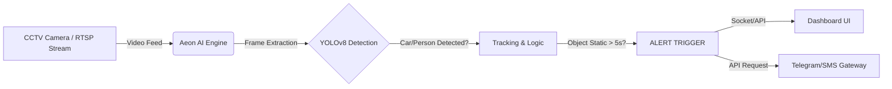

# System Architecture & Technology Stack

## 1. High-Level Architecture
The system follows a standard **Edge AI Pipeline** architecture designed for low latency.

## 2. Core Modules

### A. Input Layer
- **Protocol:** RTSP (Real-Time Streaming Protocol) over TCP.
- **Simulation:** OpenCV `VideoCapture` reading MP4 files for offline demos.

### B. AI Processing Engine
- **Model:** YOLOv8 (You Only Look Once) - Version: Nano (`yolov8n.pt`).
- **Framework:** PyTorch / Ultralytics.
- **Optimization:** Runs on CPU (OpenVINO compatible) or GPU (CUDA).
- **Classes Monitored:**
  - `Car` (ID: 2)
  - `Motorcycle` (ID: 3)
  - `Bus` (ID: 5)
  - `Truck` (ID: 7)
  - `Person` (ID: 0)

### C. Business Logic (The "Stuck" Algorithm)
The core safety logic is defined as:
1.  **ROI Definition:** User draws a polygon (Region of Interest) on the tracks.
2.  **Object Tracking:** Use **BoT-SORT** or **ByteTrack** (built into YOLOv8) to assign unique IDs to objects.
3.  **Timer Logic:**
    *   `IF` Object Center is inside `ROI`
    *   `AND` Velocity is near 0
    *   `Start Timer(Object_ID)`
    *   `IF` Timer > `THRESHOLD` (e.g., 5 seconds) -> **RAISE CRITICAL ALARM**.

### D. Image Enhancement (The "Fake Thermal")
- **Technique:** False-Color Image Processing.
- **Algorithm:** Grayscale Conversion -> Apply Colormap (`cv2.COLORMAP_INFERNO`).
- **Purpose:** Increases contrast in low-light/foggy demos without needing IR sensors.

## 3. Tech Stack (MVP 3-Day Sprint)

| Component | Technology | Why? |
| :--- | :--- | :--- |
| **Language** | Python 3.9+ | Standard for AI/ML. |
| **Frontend** | Streamlit | Fastest way to build data dashboards. |
| **Computer Vision** | OpenCV | Robust image manipulation. |
| **AI Model** | YOLOv8 | Best balance of speed/accuracy. |
| **Notifications** | Python-Telegram-Bot | Free, instant, mobile-friendly. |
| **Deployment** | Localhost (Laptop) | Safest for live stage demos. |
